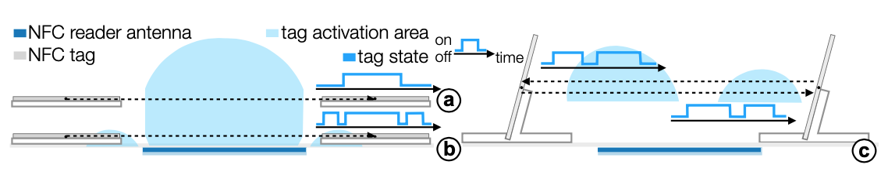
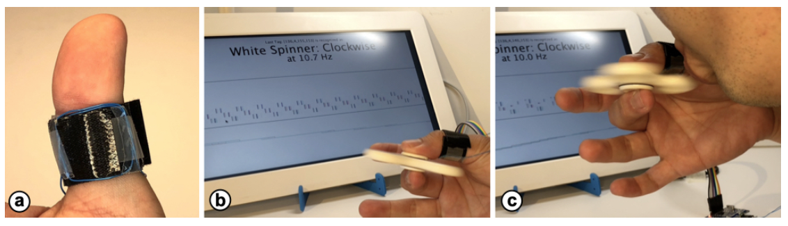

___ACM CHI '21: CHI Conference on Human Factors in Computing Systems, Yokohama, Japan, May 2021___

## NFCSense: Data-Defined Rich-ID Motion Sensing for Fluent Tangible Interaction Using a Commodity NFC Reader
__Rong-Hao Liang, Zengrong Guo__
_TU Eindhoven_

### Abstract
This paper presents _NFCSense_, a data-defined rich-ID motion sensing technique for fluent tangible interaction design by using commodity near-field communication (NFC) tags and a single NFC tag reader. An NFC reader can reliably recognize the presence of an NFC tag at a high read rate (\~300 reads/s) with low latency, but such high-speed reading has rarely been exploited because the reader may not effectively resolve collisions of multiple tags. Therefore, its human–computer interface applications have been typically limited to a discrete, hands-on interaction style using one tag at a time. In this work, we realized fluent, hands-off, and multi-tag tangible interactions by leveraging gravity and anti-collision physical constraints, which support effortless user input and maximize throughput. Furthermore, our system provides hot-swappable interactivity that enables smooth transitions throughout extended use. Based on the design parameters explored through a series of studies, we present a design space with proof-of-concept implementations in various applications. 

### Full Video
[](https://www.youtube.com/watch?v=8eCY8QbDzgg)

### Cheatsheet (One-page Summary)
[](figures/NFCSenseCheatSheet_v1.png)
- Download:[pdf](aassets/NFCSenseCheatSheet_v1.pdf)

### Extra Demo
- Running an Unmodified RC522 NFC Reader at 300Hz with Arduino Uno [Source Code: Github](https://github.com/howieliang/NFCSense)

[](https://www.youtube.com/watch?v=tl8EKAQNlNc)

### Links and Downloadables
- [ACM Digital Library](https://doi.org/10.1145/3411764.3445214) (the link will be available after May 8, 2021)
- Paper: [(Pre-print; pdf)](assets/chi21_preprint_lowres.pdf)
- Press Kit: (TBA; contact r.liang@tue.nl)
- Dataset and Source Codes: [Github repository](https://github.com/howieliang/NFCSense)
- Open NFCSense Library! (Coming soon)

### Keywords
NFC, Rich-ID, Motion Sensing, Tags, Physical Constraints, Fluent, Tangible Interaction

### [Check More Rich-ID Interactivity Projects](https://rich-id-interactivity.page)

### Introduction
Near-field communication (NFC) systems have been widely deployed for object identification. Recently, NFC readers have also become integrated into many smartphones and smart devices to enable their users to easily and privately access NFC tag information without using their camera. An NFC reader, known as a high-frequency (HF) radio-frequency-identification (RFID) reader, can reliably recognize the presence of a tag at a high read rate (e.g., ∼300 tags/second), which makes NFC useful in industrial applications, such as workflow management.

Human–computer interaction (HCI) researchers have also extensively used NFC or RFID tags for prototyping tangible user interfaces (TUIs) [22] because of their low price and ready availability [31, 34, 45]. However, this high-speed mode in single-tag reading has been rarely exploited in the context of HCI applications. Unlike machines, we as humans cannot operate a tag at such a consistently high speed. We may use multiple tags simultaneously. However, unfortunately, an NFC or HF RFID reader is potentially unable to resolve collisions of multiple tags effectively; alternatively, such readers may require an additional time-domain mechanism, such as dynamic framed slotted ALOHA (DFSA) [10], which results in the reader taking extra time to resolve the tag collisions. Furthermore, the order in which tags appear cannot be guaranteed. These reliability and efficiency concerns potentially hinder the user experience. In general, the HCI application of NFC tags is limited by a discrete, hands-on interaction style where one tag is used at a time.

To remedy this problem, in this paper, we present NFCSense, a data-defined rich-ID motion sensing technique for fluent tangible interaction design. The design space is defined based on data collected from commodity NFC tags and an NFC reader operating in the high-speed reading mode, which allows the motion features of an action performed on a tagged object to be extracted and recognized from the rich-ID time-series data. Our investigation began with an analysis of the feasibility of repurposing a commodity NFC reader as a speed sensor for obtaining data on the transient time-domain features (i.e., speed and frequency) of a moving NFC tag. Subsequently, we determined the optimal design parameters for practical use by analyzing data on the three-dimensional (3D) activation map of NFC tags. A tangible interaction design space, including the primitive designs of physical tokens, constraints, and motion sensing algorithms, was defined by these acquired parameters.

__Figure 1: Examples of fluent tangible interactions based on NFC Tags, physical constraints, and a 300-reads-per-second NFC reader: (a) measuring the speed and type of movement; (b) monitoring the speed at which the orientation of a tag-embedded fidget spinner rotates; (c) performing a batch operation with a tag position modulator, which ensures that collisions are avoided and the workflow is accelerated.__

The applicability of this approach was demonstrated by a proof-of-concept implementation of a system, which comprised a set of designs for fluent tangible interaction. Figures 1 a and 1 b show that the system can extract the time-domain features from the effortless actions performed by users on the NFC-tagged object. As indicated in Figure 1 c, with a physical constraint that modulates the tag's location and ensures that signal collisions are avoided, batch operations on multiple NFC tags can be performed to accelerate the workflow and increase throughput. In this study, we also explored wearable and non-planar reader antenna designs to extend the scope of use and the range of platforms through which this technique can be employed.

NFCSense not only enables new input modalities but also provides hot-swappable interactivity. Because a commodity NFC reader can reliably identify a virtually unlimited number of IDs in a contactless fashion, the system automatically identifies which set of algorithms to use for a given type of tagged object when the user interchanges the hardware components on the go. The smooth transition warrants fluent user experiences in an extended period of use when multiple tagged objects are involved.

Our main contributions are two-fold, spanning the domains of engineering and design: 1) we realized the data-defined rich-ID motion sensing approach by using a commodity NFC reader, which was validated through technical validation and a proof-of-concept implementation and 2) we formulated a fluent tangible interaction design space that is enabled by hot-swappable interactivity with existing objects. By using simple readily available hardware, HCI researchers and designers can apply our method for rapid prototyping TUI in conjunction with existing objects for a wide range of computing applications in education, entertainment, and health care. We also envision this technique to be further generalized for enriching the design space of mobile human-computer interaction as many smart devices (e.g., smartphones) have a built-in NFC reader nowadays.

The remainder of the paper is organized as follows. First, we present the background of our study and review the literature. Subsequently, we describe our feasibility study and series of data-driven analyses. Thereafter, we present our data-defined rich-ID motion sensing approach, which was based on the aforementioned analyses, as realized in a proof-of-concept TUI system that instantiated our interaction designs in practical applications. Finally, we conclude this study by discussing design implications, limitations of this study, and future research directions.

__Figure 2: NFC system: (a) overview and (b) coil model. (c) Motion involved in tag activation.__

__Figure 3: Feasibility study: (a) experimental apparatus; (b) NFC tag read duration slightly increases when a tag is detected, but the read duration is less than 3.2 ms; (c) at 300 Hz, the NFC reader achieved comparable performance with a Hall sensor, although further investigation is required regarding the activation threshold.__

__Figure 4: Measurement of the activation map of a non-tilted tag: (a) experiment apparatus; (b) activation map of a non-tilted tag; (c) completed activation map derived from the measured quadrant; (d) cross section at y = 0mm shows that z\* = 6mm; (e) cross sections at z = [7, 12, 17, 22, 27, 32]mm > z\*; (f) cross section at z = 4mm < z*.__

__Figure 5: An NFC tag that could be fixed at various angles of tilt: (a) experimental apparatus and model; (b) measured activation maps and cross-sections at y = 0, which shows θ\* = 30°.__

__Figure 6: Measured activation maps and cross sections at y = 0 of a pair of separated tags at various distances, showing the effects of dgap.__

__Figure 7: More NFC tag samples: (a) experimental apparatus. The PVC coating of T0 is removed to show the antenna structure. (b) Measured activation maps and (c) cross sections at y = 0.__

__Figure 8: Form primitives of tokens: (a) z < z\*, (b) z > z\*, (c) θ > θ\*, and (d) 
dgap>dgap\*.__

__Figure 9: Activation signal patterns of different primitives: (a) z < z\*, (b) z > z\*, and (c) θ > θ\*, where θ < 90°.__

__Figure 10: Form primitives of physical constraints: (a) linear constraint, (b) rotational constraint, and (c) simple harmonic motion (S.H.M.) constraint.__

__Figure 11: Workflow for extracting the motion features from rich-ID square waves.__

__Figure 12: Features of the implemented example: (a) reader, (b) track, (c) boat, (d) figurine, (e) white spinner, (f) black spinner, (g) swing, (h) car, (i) trolley, and (j) pillar.__

__Figure 13: Sensing the frequency of different types of motion: (a) rotation frequency of the black spinner, (b-c) rotation frequency and direction of the white spinner, and (d) frequency of simple harmonic motion of the swing.__

__Figure 14: Sensing the speed of NFC-tagged objects: (a) a boat moved by a hand, (b) a boat released from the top of a track, and (c) a trolley manipulated by two hands holding the track.__

__Figure 15: Additional input modes based on various signal patterns for different types of motion: (a) user walking the figurine along the track, (b) user jumping the figurine over the reader, (c) user moving the car forward along the track, and (d) user moving the car backward along the track.__

__Figure 16: (a) Multiplexer recognizes the input sources through differences in signal pattern or speed. (b) Sorter allows the user to construct semantic objects by assembling the NFC-tagged building blocks into a 1D array to get the tag read in a single release.__

__Figure 17: (a) Funnel eases the tag placement of a few tags. (b-d) Modulator modulates the tag positions to enable batch operations. The user throws a handful of NFC tags into the container and rolls the plate using the other hand to hold the handle behind. The position of each tag gets modulated before it is read.__

__Figure 18: Finger-worn antenna that allows for always-available input once worn: (a) implementation; (b) recognizing the fidget spinner and its movements without requiring the user to approach a reader antenna; (c) allowing embodied interactions, such as blowing on the wing to speed it up.__

__Figure 19: Customized antenna array for capturing the speed of a tag-embedded marble: (a) implementation of 1 × 3 two-turn antenna array and a tag-embedded marble; (b–c) marble movement being captured when the tag is tilted 90°; cases can be distinguished by the number of pulses.__

### Acknowledgement
The first author would like to thank his wife and kids for supporting most of the fabrication and experiments to be completed at home. 

### Cite this Work
```
@InProceedings{liang2021nfcsense,
author = {Liang, Rong-Hao and Guo, Zengrong},
title = {NFCSense: Data-Defined Rich-ID Motion Sensing for Fluent Tangible Interaction Using a Commodity NFC Reader},
booktitle = {Proceedings of the 2021 CHI Conference on Human Factors in Computing Systems},
location = {Yokohama, Japan},
publisher = {Association for Computing Machinery},
address = {New York, NY, USA},
url = {https://doi.org/10.1145/3411764.3445214},
articleno = {Paper 174},
numpages = {14},
year = {2021},
month = {May},
publisher = {ACM},
}
```