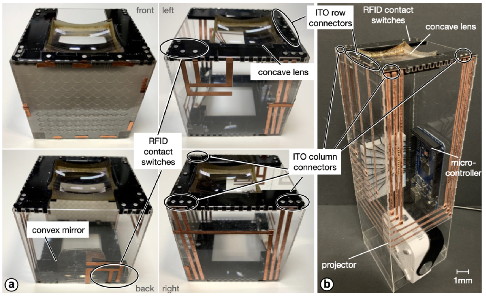

___ACM CHI 2021: ACM SIGCHI Conference on Human Factors in Computing Systems___

## Combining Touchscreens with Passive Rich-ID Building Blocks to Support Context Construction in Touchscreen Interactions
__Chin-Yuan Lu<sup>\*1</sup>, Han-Wei Hsieh<sup>\*1</sup>, Rong-Hao Liang<sup>\*2</sup>, Chi-Jung Lee<sup>1</sup>, Ling-Chien Yang<sup>1</sup>, Mengru Xue<sup>2</sup>, Jr-Ling Guo<sup>1</sup>, Meng-Ju Hsieh<sup>1</sup>, Bing-Yu Chen<sup>1</sup> (\*: contributed equally)__

_National Taiwan University<sup>1</sup>, TU Eindhoven<sup>2</sup>_

### Video
[](https://www.youtube.com/watch?v=5IQ4UVGz1zk)

### Abstract
This research investigates the design space of combining touchscreens with passive rich-ID building block systems to support the physical construction of contexts in touchscreen interactions. With two proof-of-concept systems, RFIPillars and RFITiles, we explore various schemes for using tangible inputs for context enrichment in touchscreen interactions. Instead of incorporating an electronic touchscreen module that requires per-module maintenance, this work intentionally makes each tangible object passive. We explore rear-projection solutions to integrate touchscreen interactions into these passive building blocks with capacitive touch sensing techniques and deliberate physical forgiving to retain the merits of being both batteryless and wireless. The presented research artifacts embody the interaction designs and elucidate scalability challenges in integrating touchscreen interactions into this emerging tangible user interface.

### Keywords
RFID; Stackable; Touchscreen; Rich-ID; Building Blocks, Capacitive Sensing, Rear-Projection, Modular Interface, Tangible User Interface

### Links and Downloadables
- [ACM Digital Library](https://doi.org/10.1145/3411764.3445722) (the link will be available after May 8, 2021)
- Paper: [(Pre-print; pdf)](assets/chi21b_preprint.pdf)

### Introduction
Passive rich-ID building blocks [15], based on ultrahigh-frequency radio-frequency identification (UHF RFID) sensing, were recently proposed to support the interactive semantic construction of digital information. These rich-ID building blocks support wireless geometry resolution by leveraging a paired magnetic contact switch mechanism, which ensures a reliable low-ohmic connection and physical alignments between the modified RFID tags such that the (un)stacking events can be resolved from the concurrent presence or absence of two tags. Thanks to the batteryless and wireless UHF RFID tags, these rich-ID building blocks provide virtually unlimited IDs without a battery or microcontroller, making deployment and maintenance easier than for active building blocks when at scale.

__Figure 1: Two conceptual systems that provide fluent transition between touchscreen and tangible interaction modes on passive rich-ID building blocks. (a) Constructive assemblies: an expansible touchscreen made with rich-ID cubes, allowing for a semantic screen construction by stacking them on the base station; (b) Stackable touchscreen: a tile-like touchscreen that recognizes transparent rich-ID cards stacked on it and allows for touch interactions through the cards.__

Nonetheless, because these passive building blocks are not touchscreens, they do not support touchscreen interactions, which are often more effective and intuitive. Interacting with these building blocks usually relies on only stacking operations; thus, the inputs are discrete, gross-grained, and effortful. Furthermore, because the building blocks do not provide a dynamic display, interaction with them usually relies on an external screen, which makes the visual output indirect. Hence, a seamless integration of touchscreen interactions that enables the performance of more fluent user experiences on this emerging tangible user interface [17] is desired.

Simply adding an active touchscreen module to the surface of each rich-ID block can be a straightforward yet effective solution, as demonstrated in PickCells [9]. However, introducing power electronics per unit increases hardware and maintenance costs, burdening further system deployment. Therefore, we explore a more challenging solution to the following research question: How might touchscreen interactions be integrated into the building blocks in a more scalable manner?

In this paper, we took a research-through-design [52] approach to investigating a plausible design for touchscreen integration using passive rich-ID building blocks. We realized two conceptual systems (Figure 1) to embody touchscreen interactions on passive rich-ID building blocks, either as constructive assemblies or as a stackable touchscreen, through prototyping two proof-of-concept systems, RFIPillars and RFITiles. With deliberate technical designs using rear-projection and RFID-capacitive sensor fusion techniques, we enabled a seamless and fluent transition between touch and tangible interactions without adding power electronics to each block. We constructed fantasy applications upon these prototypes to demonstrate the interaction styles.

___1.1 Constructive Assemblies: RFIPillars ___

The first system, RFIPillars (Figure 2), comprises cubes and stations. A cube is a passive rich-ID building block augmented by a rear-projection screen with an overlain transparent capacitive electrode matrix; a station is an active unit in which a pico projector and a signal processing unit are embedded. Through the lens and mirrors built into the cubes, each station projects a dynamic visual display for each cube stacked upon the station and processes the touch input events from the cubes to enable touchscreen interactions.

__Figure 2: (a,b) RFIPillars is an interactive building block system that enabled occlusion-free touchscreen interactions on rich-ID passive stackables by leveraging rear-projection. (c) passive cube.__

_Defining the Touch Interaction Context through Semantic Stacking._ The cubes in RFIPillars are in a 3D form that provides rich possibility and tangibility for interaction design [24], and they have a bezel-less visual display that provides continuity. Therefore, the cubes form an expandable touchscreen that allows users to define the interaction context through semantic stacking.

Figure 3 depicts an advanced Tangible Minecraft game, which was extended from a previous work [15]. We deployed a 1 × 2 grid of stations as a playground and used several cubes to represent four types of building blocks: grass, tree, rock, and chicken. The user first stacks a tree on the grass and sees the tree root sink into the grass yard. The tree block displays the weather through the movement of clouds. Thereafter, the user places a stone next to the tree and puts the chicken on the rock to see a chicken nest atop the rock. The user then teases the chicken by touching the block and sees the happy chicken lay eggs into the nest.

__Figure 3: In Tangible Minecraft, the touch interaction context is defined through semantic stacking operations.__

_Two-Dimensional Stacking Using Portable Stations._ The cubes can only be stacked in one dimension on each station, but the stations can be stacked side by side to extend the stacking operations to the second dimension.

Figure 4 portrays a Tangible Room Escape game. We deployed three stations as the playground and three cubes representing different rooms: one with a gate and a upward-facing ladder, one with a downward-facing ladder, and one with a wall splitting the room into two compartments, where a treasure chest is in one of them. The user stacks the rooms on the ground and touches the screen to move the character to the desired location. The user merges two stations to connect two rooms, allowing the character to walk into another room. When there seems to be no way to obtain the chest, the user finds a new route by swapping the two stations and stacking them. Finally, the user builds a path downstairs by stacking a room with a ladder down on another one with a ladder up and then walks the character out the gate to escape.

__Figure 4: In Tangible Room Escape, users solve a puzzle by stacking the cubes in one direction, and stacking the stations in another direction.__

These examples demonstrate seamless transition between the modes of touchscreen and semantic stacking interaction. The users use rich-ID building blocks to define the context and perform fine-grained touch inputs on the focus. The building blocks afford semantic constructions that make screen expansion meaningful. The rear-projection and capacitive touch sensing support occlusion-free touchscreen interactions.

___1.2 Stackable Touchscreen: RFITiles ___

The second system, RFITiles (Figure 5), is an improvement of the previous RFIDesk [14] system that is aimed at reducing the visual parallax problem and providing higher-resolution touch interaction. The RFITiles system comprises cards and tiles. Each card is a thin-form passive rich-ID building block augmented by an overlain transparent capacitive electrode matrix. Tiles are tiled on a rear-projection surface and connected to a signal processing unit. The rear-projection interactive surface provides a dynamic visual display for each card and tile stacked upon it, and the system processes the touch input events from the capacitive electrode matrix to enable touchscreen interactions through the cards and tiles.

__Figure 5: (a) RFITiles is a tile-like touchscreen that support touch inputs through a stack of rich-ID cards on the tiles. (b) The card implementation in RFITiles provides better visual experiences and higher touch input resolution than do (c) the block implementation in the previous RFIDesk system [14].__

_Upgrading Modes Through Semantic Stacking._ The cards are stacked at the same location, allowing for the upgrading of the modes according to the cards used in the semantic stacking. Figures 5 and 6 are images of an improved tangible version of a grid-based tower defense game, Plants vs. Zombies 1, that has been implemented in RFIDesk [14]. In the game, users can deploy, upgrade, and combine weapons and defenses by stacking the ID cards at the grid position and can still perform touch inputs to trigger events. For instance, the user can upgrade a weapon by stacking the same cards or fuse different weapons by stacking different ID cards. Notably, the rich-ID stackables proposed in this work provide better visual experiences and higher touch input resolution than does the previous implementation, which was disadvantaged by notable visual parallax and tag antenna occlusions.

__Figure 6: In Tangible Tower Defense, the user incrementally updates the mode of touch inputs at the same location by stacking rich-ID cards. The order and combination of the stacked cards enrich the context.__

_Rich Touch Interactions through the Stack._ Input methods may vary between input modes. Figure 7 demonstrates the greater variety of touch interactions in a cooking game that were made possible by stackables. The user can stack the passive cards to bring materials into the game. The user can stack the passive cards to bring the materials onto the production line and then modify their parameters (e.g., quantity, frequency, and amplitude) through direct touch inputs, which allow the user to complete these tasks more efficiently. For instance, instead of stacking three tomato cards, the user can achieve the same result by calling out a numpad with a double-click gesture and then typing the number (Figure 7 c and 7 d). The tap and swipe operations also make the discrete interactions more engaging (Figure 7 e) and fluent (Figure 7 f). More importantly, these touch inputs are volatile. Thus, they do not occupy the stack, and users can fully utilize the rich-ID stackables for semantic construction. Users can bring a stack of a sorted list of materials to the stage and perform the operation in a batch, as in the tangible programming example demonstrated in RFIBricks [15].

__Figure 7: In Tangible Programming applied to a cooking task, the user performs various touch input methods after building the context by stacking rich-ID cards.__

___1.3 Summary and Contributions ___
Stack inputs are discrete and effortful after an extended period of use, especially with graspable objects such as RFIBricks [15]. Therefore, leveraging GUI and touchscreen inputs on the surface of stackables can increase the fluidity and expressivity of interactions. Rich-ID blocks do not require further GUI configurations on the user side because every unit is unique. The bindings can be preprogrammed; thus, they are perfectly suitable for building the background context of foreground touchscreen interactions. To fully leverage the scalability of rich-ID systems, we made these blocks passive, maintenance-free, and as calm as Lego bricks for ubiquitous computing environments [44].

The main contribution of this paper is two-fold. 1) The realization of a novel interaction system that supports a smooth transition between touchscreen and semantic stacking interactions. Users of this system can construct the touchscreen interaction context using rich-ID building blocks and then interact with the focused content through rich and efficient touch interactions in a post-WIMP interaction scheme [19]. 2) The knowledge created in the process and the results of building these research artifacts help the HCI community better understand the solution space of reconfigurable touchscreen designs. We disclose the practical limitations of this passive approach through a series of technical evaluations, which also inform directions for future development. We further reflect on our assumptions by comparing our rear-projection approach with the electronic one, thereby providing a relatively nuanced design prescription for deployment scales.

The remainder of the paper is organized as follows. First, we discuss the related work. Then, we present the system design and proof-of-concept implementation with a series of technical evaluations. Finally, we discuss the limitations and design implications and draw a conclusion.

__Figure 8: Hardware overview of a 3 × 3 touch resolution. (a) Cube and (b) station.__

__Figure 9: Cube and station implementation with 9 × 9 resolution of touch input.__

__Figure 10: Sensor deployment of an example RFIPillar with 3 × 3 touch sensing resolution. (a) Cube and station, (b) stacking a cube on a station activates two RFID switches simultaneously, and (c) signal pass-down circuitry aggregates all the sensors on the stack.__

__Figure 11: (a) Two-layer stacks of 3 × 3-resolution cubes on a 1 × 3 grid of stations. (b) 9 × 9 resolution cubes on a 1 × 3 grid of stations.__

__Figure 12: Visual display. (a) before and (b) after calibration, (c) results, and (d) projection path.__

__Figure 13: Experimental apparatus in the technical evaluation of the RFIPillars.__

__Figure 14: Response time vs. accuracy. (a) 3×3 resolution and (b) 9×9 resolution.__

__Figure 15: Hardware overview of and touch sensing on four-edge cards and tiles. (a) Tile, (b) card, (c) stacking a card on a tile, and (d) results.__

__Figure 16: Antenna design and stack sensing in two-edge and four-edge designs. (a) four-edge tile, (b) four-edge card, (c) stacking a four-edge card on a four-edge tile, (d) two-edge tile, (e) two-edge card, and (f) stacking a two-edge card on a two-edge tile. The stacking operations switch on two UHF RFID tags simultaneously.__

__Figure 17: A comparison of the two-edge and four-edge designs. (a) two-edge card, (b) four-edge card, (c) two-edge tile, and (d) four-edge card.__

__Figure 18: Hardware design and example deployment of the interactive surface for touch interactions through rich-ID stackables. (a) Vertical setting, (b) horizontal setting.__

__Figure 19: Implementation of a vertical setting. (a) Overview, (b) results.__

__Figure 20: Experimental apparatus of the technical evaluation of four-edge cards and tiles.__

__Figure 21: Experimental apparatus in the technical evaluation of two-edge cards and tiles.__

__Figure 22: Touch sensing performance by layers.__

__Figure 23: (a) Tile and card that support 9 × 9 touch inputs. (b) Touch before stacking, (c) stacking, (d) touch after stacking.__

__Figure 24: Advanced touch gestures supported by the self-capacitance touch sensing matrix: (a) multi-finger selection, (b) fist, and (c) palm.__

__Figure 25: Improving the transparency of touch electrodes through laser engraving. (a) Results. (b) A stack of Cards.__

__Figure 26: (a) Tile and (b) Card that are made of the laser-engraved transparent touch sensor. (c) Touch before stacking. (d) Touch after stacking.__

__Figure 27: (a) Tile and card that support 180-degree rotation. (b) Touch before rotation, (c) rotating the card, and (d) touch after rotation.__

__Figure 28: Four-sided display cube that supports rotation operations. (a–c) overview, (d) 3-layer stack of cubes on a station, and (e) result in the form of a pattern matching game.__

__Figure 29: Visual cue for using the transparent cards.__

## Cite this Work
```
@InProceedings{lu2021ctpr,
author = {Lu, Chin-Yuan and Hsieh,Han-Wei and Liang,Rong-Hao and Lee, Chi-Jung and Yang, Ling-Chien and Xue, Mengru and Guo, Jr-Ling and Hsieh, Meng-Ju and Chen, Bing-Yu},
title = {Combining Touchscreens with Passive Rich-ID Building Blocks to Support Context Construction in Touchscreen Interactions},
booktitle = {Proceedings of the 2021 CHI Conference on Human Factors in Computing Systems},
location = {Yokohama, Japan},
publisher = {Association for Computing Machinery},
address = {New York, NY, USA},
url = {https://doi.org/10.1145/3411764.3445722},
articleno = {Paper 676},
numpages = {14},
year = {2021},
month = {May},
publisher = {ACM},
}
```